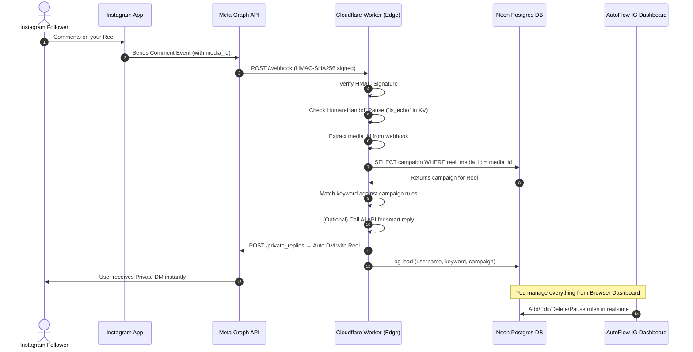

# 🤖 AutoFlow IG — Instagram DM Automation SaaS Engine

<div align="center">

**Upload a Reel → Set a keyword/emoji → Automatically send a Private DM to commenters**

[](https://workers.cloudflare.com)
[](https://neon.tech)
[](https://nextjs.org)
[](LICENSE)
[](https://neon.tech)
[](https://developers.facebook.com)
[](https://neon.tech)

</div>

---

🔥 **[Setup Guide (English)](./SETUP_GUIDE_EN.md)** | **[सेटअप गाइड (Hinglish)](./SETUP_GUIDE_HI.md)** 🔥

---

## 🎯 What Does This App Do?

**AutoFlow IG** is a **serverless Instagram DM Automation system** that converts your Instagram Reels, Posts, and Stories into an automatic lead generation machine.

### Real-World Example:

> **You post a Reel and write in the caption:**
> *"Comment 'tool' if you want the link, and I will DM it to you 🔥"*
>
> ✅ The moment someone comments (whether it's "link", "tool", "🔥", "❤️" — anything you set) —
> **AutoFlow IG automatically sends a Private DM to that user** containing your desired link.
>
> **You are sleeping, AutoFlow IG is working.**

### Works Flawlessly with 100+ Reels:

> **Reel #1** (AI Tool) → keyword "tool" → Link A DM
> **Reel #2** (Online Course) → keyword "course" → Link B DM
> **Reel #50** (Old Reel) → "Any Comment" mode → Link C DM
>
> ✅ Each Reel has its own isolated campaign. The webhook matches the `media_id` —
> **only that specific reel's template is triggered, no cross-mixing.**

---

## 🏆 How Does It Compare?

| Feature | **AutoFlow IG** | ManyChat | Manychat Free | Respond.io | Zapier |
|---|---|---|---|---|---|
| **Instagram Comment → DM** | ✅ Full | ✅ Full | ⚠️ Limited | ✅ Full | ⚠️ Limited |
| **Custom Keywords** | ✅ Unlimited | ✅ Paid | ❌ No | ✅ Paid | ⚠️ Limited |
| **Custom Emojis Triggers** | ✅ Yes (🔥❤️👇) | ✅ Paid | ❌ No | ✅ Paid | ❌ No |
| **"Any Comment" Mode** | ✅ Yes | ✅ Paid | ❌ No | ✅ Paid | ❌ No |
| **Per-Reel Campaign** | ✅ Yes (media_id) | ✅ Paid | ❌ No | ✅ Paid | ❌ No |
| **Story Mention → DM** | ✅ Yes | ✅ Paid | ❌ No | ✅ Paid | ❌ No |
| **🤖 AI Smart Auto-Replies**| ✅ Yes (Custom API)| ❌ No | ❌ No | ✅ Paid | ❌ No |
| **Human Handoff Pause** | ✅ Yes (1-hour pause)| ❌ No | ❌ No | ✅ Paid | ❌ No |
| **Lead Capture Database** | ✅ Neon Postgres | ✅ Paid | ❌ No | ✅ Paid | ❌ No |
| **CSV Export (Leads)** | ✅ Yes | ✅ Paid | ❌ No | ✅ Paid | ❌ No |
| **Monthly Cost** | **🆓 $0 Free** | 💸 $15–$50/mo | $0 Limited | 💸 $49+/mo | 💸 $20+/mo |
| **Self-hosted** | ✅ Yes | ❌ No | ❌ No | ❌ No | ❌ No |
| **Own Data** | ✅ Yes (Neon DB) | ❌ Their servers | ❌ Their servers | ❌ Their servers | ❌ Their servers |
| **Custom Domain** | ✅ workers.dev | ✅ | ✅ | ✅ | ✅ |
| **Speed** | ⚡ Sub-50ms Edge | ~500ms | ~500ms | ~300ms | ~1000ms |

> **Bottom Line:** AutoFlow IG does what a $50/month tool does, but for **$0**, and you own all your data on your own cloud database.

---

## 🚀 Key Features

### 1. 🎬 Reel Comment → Auto DM (Core Feature)
- Paste your Instagram Reel link
- Set custom keywords: `tool`, `link`, `price`, etc.
- Set custom emojis: `🔥`, `❤️`, `👇`, `💯`
- **Whenever someone comments → the user automatically gets a Private DM** with your link.
- You can use `{username}` and `{keyword}` variables in the DM message.

### 2. 🔄 "Any Comment" Mode — Zero Keyword Required
- Select **"Any Comment"** mode when creating a campaign.
- Now **any comment will trigger the DM**, regardless of what is written.
- Ideal for captions like: *"Comment anything, and I'll DM you the link"*

### 3. 🎯 Per-Reel Campaign Matching (Multi-Reel Support)
- **Problem Solved:** Create 100+ reels — each reel gets its own campaign.
- Store the **Instagram Media ID** in each campaign.
- When a webhook arrives → the worker matches the exact campaign via `media_id` in Neon DB.
- **Only that reel's DM template is used** — no cross-mixing of links.

### 4. 📸 Story Mention → Auto DM Reward
- When someone mentions your account in their Story.
- **They automatically receive a Thank You DM + CTA button link.**
- Convert story mentions into leads instantly.
- Manage Story triggers directly from the browser dashboard.

### 5. 👥 Lead Database (Captured Subscribers)
- Every commenter's Instagram username is saved into the Neon DB.
- Tracks engagement count automatically.
- **CSV Export** — download all your leads as a `.csv` with one click.
- **Search by username** — filter through large lead lists.
- **Build an Instagram lead list just like an email list.**

### 6. 🤖 AI Smart Auto-Replies
- **Dynamic Human-like DMs:** Use any OpenAI-compatible API (OpenAI, Groq, Claude proxy) to send natural replies.
- **Context Aware:** AI generates the message by combining the user's comment, trigger keyword, and your link.
- **Edge Compatible:** Cloudflare worker directly talks to the AI endpoint; no extra DB roundtrip needed for generation.
- **Dynamic Model Fetching:** Instantly fetches available models via the UI.

### 7. 👤 Human Handoff (1-Hour Pause) & Spam Protection
- **Spam Protection:** If a user repeatedly comments, the system sends a **maximum of 3 auto-DMs** (per reel, per 24 hours). This keeps your API limits and database safe.
- **Human Handoff:** If you manually reply to someone from the browser/app (which triggers `is_echo: true`), **AutoFlow IG automatically pauses for that user for 1 hour.**
- This prevents the AI and your manual message from clashing.

### 8. 📊 Stats Dashboard — Live Campaign Overview
- **Total Rules** count
- **Active vs Paused** rules breakdown
- **Any-Comment Rules** count
- Live badges fetching real-time data from Neon DB.

### 9. ✏️ Browser-Based Campaign Manager — Full CRUD
- **Add / Edit / Rename / Delete** reel rules straight from the browser.
- **⏸ Pause / ▶ Activate** — turn off campaigns without deleting them.
- **📋 Copy DM** — copy your DM template to the clipboard instantly.
- **🔁 Duplicate** — create a copy of a campaign for a new reel easily.
- **🔍 Search** — filter the campaign list by name or keyword.
- **No coding, no servers — manage directly from the dashboard.**
- **Admin Password Protection** — secure login so only you can manage it.

### 10. ⚡ Live Keyword Matcher Tester
- Type any comment text → instantly see if a DM would trigger.
- Test Partial, Word, and Any match modes.
- Test logs are saved to Neon DB for historical tracking.

### 11. 🔒 Production Security & Encryption (15+ Layers)
- **AES-256-GCM Encryption:** All sensitive configurations (like AI API Keys) are encrypted before hitting the database using your `ADMIN_SECRET_TOKEN` as the master key. Even if the Neon DB is compromised, hackers get only scrambled ciphertext.
- **Strict HTTP Security Headers:** Enforced HSTS (Strict-Transport-Security), XSS Protection, CSP, and X-Frame-Options on all routes.
- Bearer Token API authentication (Admin-only actions).
- HMAC-SHA256 Meta Webhook Signature Verification.
- Rate limiting and Replay attack prevention (5-min event age check).
- Input validation + length limits (SQL injection prevention).
- Zlib compression for DM templates in DB.
- Self-comment filter (the worker doesn't DM your own account).
- Zod schema validation on all webhook payloads.

---

## 🏗️ Technical Architecture



### Tech Stack

| Layer | Technology | Why |
|---|---|---|
| **Edge Runtime** | Cloudflare Workers | Sub-50ms worldwide, 100K req/day free |
| **Frontend** | Next.js 16 + React | Modern dashboard UI |
| **Database** | Neon Postgres (Serverless) | 512MB free, auto-suspend = $0 idle cost |
| **ORM** | Drizzle ORM | Type-safe, lightweight, edge-compatible |
| **Auth** | Custom Bearer Token | No external dependency |
| **DB Driver** | `@neondatabase/serverless` (HTTP) | Works on Cloudflare edge without TCP |
| **Compression** | Zlib BYTEA | DM templates compressed in DB |
| **Validation** | Zod | Runtime schema validation on webhooks |
| **KV Store** | Cloudflare KV | Rate limiting + analytics events |
| **Per-Reel Lookup** | Neon HTTP API in Worker | media_id → campaign matching at edge |

---

## Setup Guide

Please refer to our detailed step-by-step Setup Guides to deploy your own instance for free:

- 🇺🇸 **[English Setup & Deployment Guide](./SETUP_GUIDE_EN.md)**
- 🇮🇳 **[Hinglish Setup & Deployment Guide](./SETUP_GUIDE_HI.md)**

---

## 📁 Project Structure

```text
autoflow-ig-automation/
├── src/
│   ├── app/
│   │   ├── page.tsx                  # Login page (Admin auth)
│   │   ├── tester/
│   │   │   └── Tester.tsx            # Main dashboard (all tabs)
│   │   └── api/
│   │       ├── auth/route.ts         # Login → Bearer token
│   │       ├── campaigns/route.ts    # CRUD for Reel DM rules
│   │       ├── features/route.ts     # Story triggers + Leads
│   │       ├── health/route.ts       # Health check endpoint
│   │       └── test-match/route.ts   # Live keyword tester
│   ├── db/
│   │   ├── index.ts                  # Drizzle DB connection
│   │   └── schema.ts                 # All table definitions
│   └── lib/
│       ├── auth.ts                   # Bearer token verification
│       └── matcher.ts                # Keyword matching logic
├── worker/
│   └── index.js                      # Cloudflare Worker (Edge webhook handler)
├── drizzle/
│   ├── 0000_initial_schema.sql
│   ├── 0001_story_triggers.sql
│   ├── 0002_test_logs.sql
│   ├── 0003_reel_url_any_mode.sql
│   └── 0004_reel_media_id.sql
├── wrangler.toml                     # Cloudflare Worker config
└── package.json
```

---

## 🙏 Acknowledgments

- [Cloudflare Workers](https://workers.cloudflare.com/) — For the blazing fast serverless edge runtime.
- [Neon Postgres](https://neon.tech/) — For the scalable, serverless, and free tier database.
- [Next.js](https://nextjs.org/) — For the modern React framework driving our dashboard.
- [Drizzle ORM](https://orm.drizzle.team/) — For making database interactions fully type-safe and edge-compatible.
- [Meta / Instagram Graph API](https://developers.facebook.com/) — For providing the robust webhook ecosystem and Messaging API.

---

## 📄 License
[MIT License](LICENSE) — Free use, modification, and distribution.

---

<div align="center">

**Built with love for Creators who want Enterprise power at Zero cost**

*AutoFlow IG — Own your data, own your audience.*

</div>
